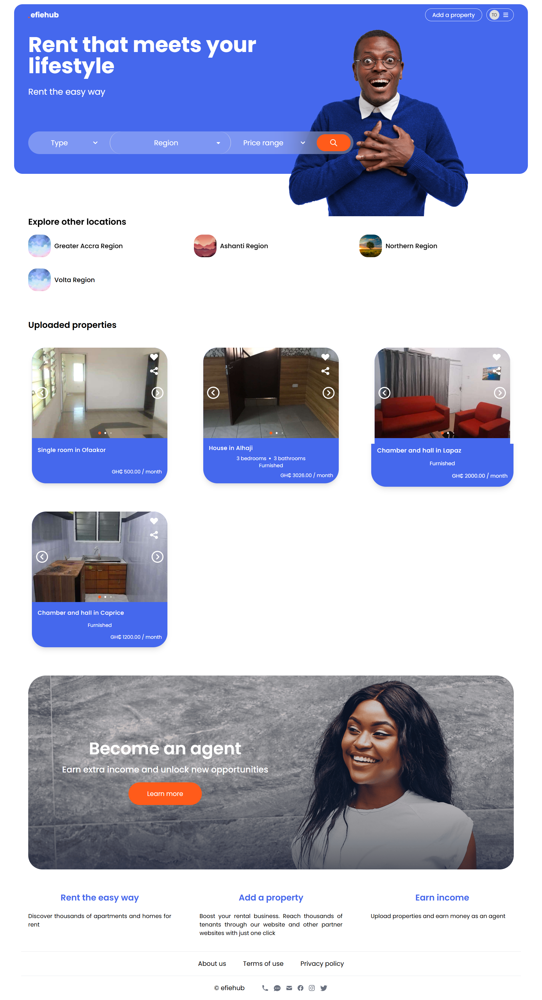
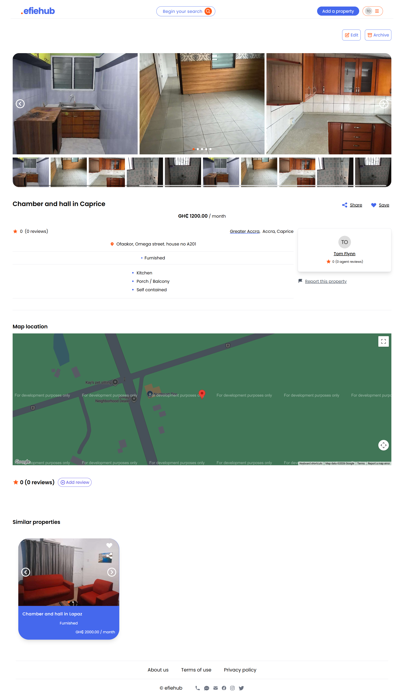
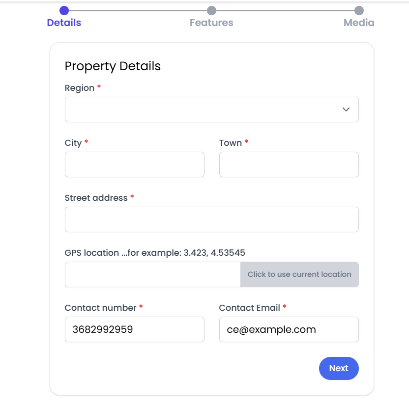
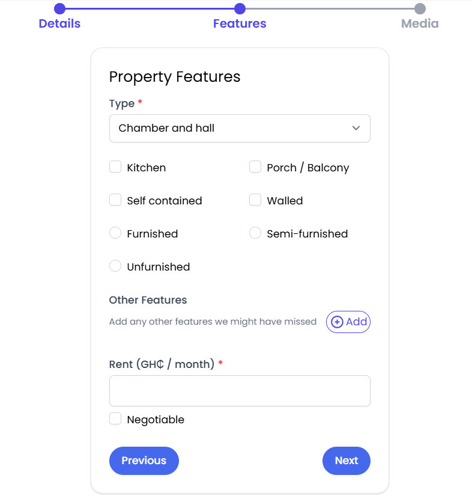
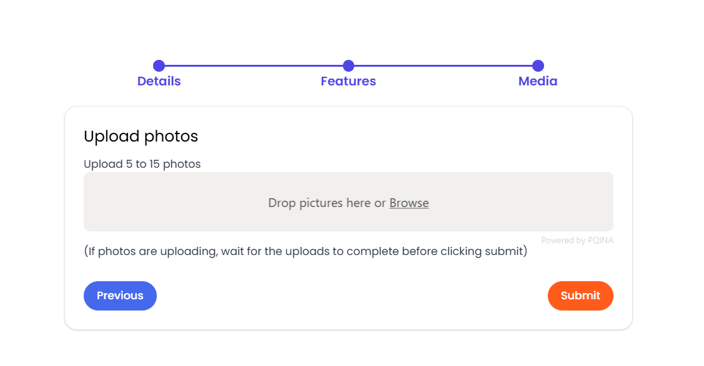
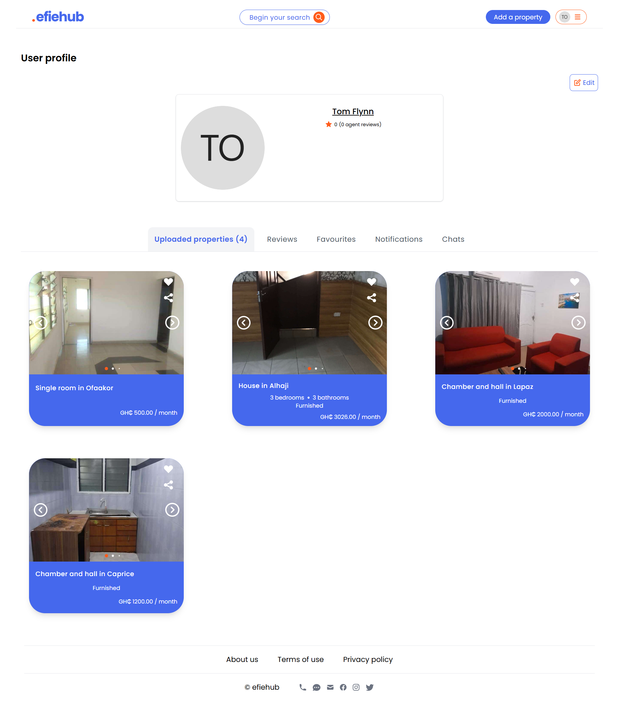
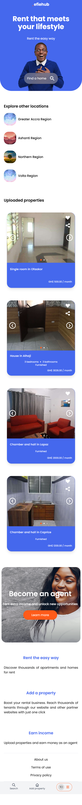
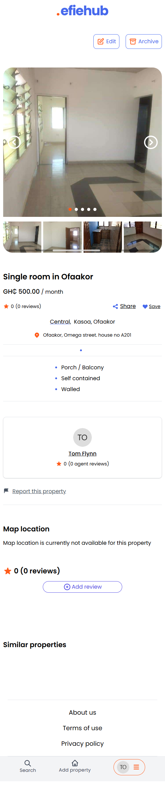

# Efiehub

<div align="center">
  <p><strong>A comprehensive e-commerce web application tailored for the rental housing market in Ghana</strong></p>
  <p>Enabling users to easily find and rent homes or rooms with powerful search, real-time chat, and seamless user experience</p>
</div>

---

## 📋 Table of Contents

- [About](#about)
- [Features](#features)
- [Screenshots](#screenshots)
- [Usage](#usage)
- [Technology Stack](#technology-stack)
- [Requirements](#requirements)
- [Installation](#installation)
- [Configuration](#configuration)
- [Testing](#testing)
- [Deployment](#deployment)
- [Contributing](#contributing)
- [License](#license)

---

## 🏠 About

Efiehub is a modern, full-stack rental housing platform specifically designed for the Ghanaian market. The application bridges the gap between property owners and potential renters by providing an intuitive interface for listing, searching, and communicating about rental properties.

Built with Laravel and Vue, Efiehub leverages the power of Inertia.js to deliver a smooth, single-page application experience with server-side rendering capabilities.

---

## ✨ Features

### Property Management
- **📝 Property Listings**: Create, edit, and manage rental property listings with detailed information
- **📸 Media Upload**: Upload multiple images per property with automatic image optimization and orientation correction
- **🏷️ Property Types & Features**: Support for various property types (apartments, single rooms, etc.) with customizable features
- **📦 Archive Properties**: Temporarily archive/unarchive listings without permanent deletion
- **🔗 Slugified URLs**: SEO-friendly URLs for all property listings

### Advanced Search & Discovery
- **🔍 Advanced Filtering**: Filter properties by region, type, price range, and amenities
- **💰 Price Sorting**: Sort results by price (low to high, high to low) or by most recent
- **🎯 Similar Properties**: Automatic recommendation of similar properties based on location and type
- **📍 Location-based Search**: Search properties across different regions in Ghana

### User Features
- **👤 User Authentication**: Secure registration, login, and password reset functionality
- **✉️ Email Verification**: Email verification for new user accounts
- **👨‍💼 User Profiles**: Customizable user profiles with profile picture upload
- **⭐ Favorites**: Save and manage favorite properties
- **📱 Request Callback**: Request property owners to call back with contact details

### Communication
- **💬 Real-time Chat**: WebSocket-based real-time messaging between users and property owners
- **🔔 Notifications**: Database-stored notifications for callbacks and important events
- **📨 Private Channels**: Secure, private chat channels for one-on-one conversations

### Reviews & Ratings
- **⭐ Property Reviews**: Rate and review properties (1-5 stars with optional text)
- **👥 User Reviews**: Rate and review property owners
- **📊 Review Display**: Display aggregated ratings and individual reviews

### Reporting & Moderation
- **🚩 Report Properties**: Flag inappropriate or fraudulent property listings
- **📝 Report Users**: Report suspicious user behavior

### Social Features
- **📤 Social Sharing**: Share property listings on social media platforms
- **🔗 Share Modal**: Easy-to-use share functionality for properties

### Analytics & Tracking
- **📊 Analytics**: Track user events and behavior for platform improvement
- **📈 Referral Tracking**: Monitor traffic sources and referrals

### User Experience
- **📱 Responsive Design**: Fully responsive mobile-first design with TailwindCSS
- **🎨 Modern UI**: Clean, intuitive interface with Headless UI components
- **⚡ Fast Navigation**: SPA experience with Inertia.js for instant page transitions
- **🔄 Progress Indicators**: Visual feedback during page loads and transitions
- **🍞 Toast Notifications**: User-friendly notifications with SweetAlert2
- **🌐 Google Maps Integration**: Interactive maps for property locations

---

## 📸 Screenshots

### Home & Discovery

| Homepage |
| :---: |
|  |

### Property Details

| Property Page |
| :---: |
|  |

### Create Property
| Details | Features | Media |
| :---: |  :---: |  :---: |
|  |  |  |

### User Experience

|                  User Dashboard                   |
|:-------------------------------------------------:|
|  |

### Mobile View

<p align="center">
  
  
</p>

---

## 📖 Usage

### For Property Seekers

1. **Browse Properties**: Visit the homepage to see the latest listings
2. **Search & Filter**: Use the search bar and filters to find properties matching your criteria
3. **View Details**: Click on any property to see full details, images, and location
4. **Save Favorites**: Register/login to save favorite properties
5. **Contact Owner**: Use the chat feature or request callback to communicate with property owners
6. **Leave Reviews**: Rate and review properties and owners after interactions

### For Property Owners

1. **Register Account**: Create an account and verify your email
2. **Create Listing**: Click "Add Property" and fill in all required details
3. **Upload Photos**: Add multiple high-quality images of your property
4. **Manage Listings**: Edit, archive, or delete your property listings
5. **Respond to Inquiries**: Use the chat feature to respond to potential renters
6. **View Notifications**: Check notifications for callback requests and messages

### Administrative Features

- View analytics and user behavior tracking
- Monitor reported properties and users
- Manage property types and features

---

## 🛠️ Technology Stack

### Backend
- **Framework**: Laravel 9.x (PHP 7.3+ | 8.0+)
- **Authentication**: Laravel Sanctum
- **API**: RESTful API architecture
- **Real-time**: Pusher (WebSocket broadcasting)
- **Image Processing**: Intervention Image
- **Monitoring**: Sentry for error tracking
- **Routing**: Ziggy (Laravel routes in JavaScript)

### Frontend
- **Framework**: Vue 3 (Composition API)
- **SPA Engine**: Inertia.js
- **Styling**: TailwindCSS 2.x with custom forms plugin
- **UI Components**:
  - Headless UI Vue
  - Hero Icons
  - Vue Final Modal
  - SweetAlert2
- **Form Validation**: Vuelidate
- **File Upload**: FilePond with plugins (image crop, resize, preview, validation)
- **Maps**: Google Maps (vue3-google-map)
- **Carousel**: Swiper.js
- **Chat**: Laravel Echo with Pusher
- **Social**: Vue Social Sharing
- **Progress**: NProgress and Inertia Progress
- **Pagination**: v-pagination-3
- **Rating**: Vue Star Rating

### Database & Storage
- **Database**: MySQL
- **File Storage**: Local/Cloud storage support
- **Caching**: Redis support (optional)

---

## 📦 Requirements

### System Requirements
- **PHP**: 7.3 or higher (8.0+ recommended)
- **Composer**: Latest version
- **Node.js**: 14.x or higher
- **npm**: 6.x or higher
- **Database**: MySQL 5.7+ / PostgreSQL 9.6+
- **Web Server**: Apache/Nginx

---

## 🚀 Installation

### 1. Clone the Repository

```bash
git clone https://github.com/yourusername/efiehub.git
cd efiehub
```

### 2. Install PHP Dependencies

```bash
composer install
```

### 3. Install JavaScript Dependencies

```bash
npm install
```

### 4. Environment Configuration

```bash
cp .env.example .env
```

Edit `.env` file with your configuration (see [Configuration](#configuration) section)

### 5. Generate Application Key

```bash
php artisan key:generate
```

### 6. Run Database Migrations

```bash
php artisan migrate
```

### 7. Seed Database (Optional)

```bash
php artisan db:seed
```

### 8. Create Storage Symlink

```bash
php artisan storage:link
```

### 9. Build Frontend Assets

For development:
```bash
npm run dev
```

For production:
```bash
npm run production
```

### 10. Start Development Server

```bash
php artisan serve
```

The application will be available at `http://localhost:8000`

---

## ⚙️ Configuration

### Database Configuration

Update your `.env` file with database credentials:

```env
DB_CONNECTION=mysql
DB_HOST=127.0.0.1
DB_PORT=3306
DB_DATABASE=efiehub
DB_USERNAME=root
DB_PASSWORD=your_password
```

### Pusher Configuration (Real-time Chat)

Sign up for a free account at [Pusher.com](https://pusher.com) and update:

```env
BROADCAST_DRIVER=pusher

PUSHER_APP_ID=your_app_id
PUSHER_APP_KEY=your_app_key
PUSHER_APP_SECRET=your_app_secret
PUSHER_APP_CLUSTER=your_cluster
```

### Google Maps API

Obtain an API key from [Google Cloud Console](https://console.cloud.google.com) and add to your `.env`:

```env
GOOGLE_MAPS_API_KEY=your_google_maps_api_key
```

### Mail Configuration

Configure your mail settings for email verification and notifications:

```env
MAIL_MAILER=smtp
MAIL_HOST=smtp.mailtrap.io
MAIL_PORT=2525
MAIL_USERNAME=your_username
MAIL_PASSWORD=your_password
MAIL_ENCRYPTION=tls
MAIL_FROM_ADDRESS=hello@efiehub.com
MAIL_FROM_NAME="${APP_NAME}"
```

### Sentry Error Tracking (Optional)

```env
SENTRY_LARAVEL_DSN=your_sentry_dsn
```

### File Storage

For local development:
```env
FILESYSTEM_DISK=public
```

For production, configure cloud storage (S3, etc.) as needed.

---

## 🧪 Testing

### Run PHP Tests

```bash
php artisan test
```

Or with PHPUnit directly:

```bash
vendor/bin/phpunit
```

### Run Specific Test Suite

```bash
php artisan test --testsuite=Feature
php artisan test --testsuite=Unit
```

### Run Specific Test File

```bash
php artisan test tests/Feature/PropertyControllerTest.php
```

---

## 🚢 Deployment

### Local Deployment Script

```bash
bash local_deploy.sh
```

### Server Deployment Script

```bash
bash server_deploy.sh
```

### Docker Deployment

A `docker-compose.yml` file is included for containerized deployment:

```bash
docker-compose up -d
```

### Production Checklist

- [ ] Set `APP_ENV=production` in `.env`
- [ ] Set `APP_DEBUG=false` in `.env`
- [ ] Run `php artisan config:cache`
- [ ] Run `php artisan route:cache`
- [ ] Run `php artisan view:cache`
- [ ] Run `npm run production`
- [ ] Configure proper database credentials
- [ ] Set up SSL certificate (HTTPS)
- [ ] Configure proper file permissions
- [ ] Set up queue workers for background jobs
- [ ] Configure backup strategy
- [ ] Set up monitoring and logging

---

## 🤝 Contributing

Contributions are welcome! Please follow these steps:

1. Fork the repository
2. Create a feature branch (`git checkout -b feature/amazing-feature`)
3. Commit your changes (`git commit -m 'Add some amazing feature'`)
4. Push to the branch (`git push origin feature/amazing-feature`)
5. Open a Pull Request

### Development Guidelines

- Follow PSR-12 coding standards for PHP
- Use Vue 3 Composition API best practices
- Write tests for new features
- Update documentation as needed
- Ensure all tests pass before submitting PR

---

## 📄 License

This project is open-sourced software licensed under the [MIT license](https://opensource.org/licenses/MIT).

---

## 🙏 Acknowledgments

- Laravel Framework
- Vue.js Community
- TailwindCSS Team
- All open-source contributors

---

## 📞 Support

For support, please open an issue in the GitHub repository.

---

<div align="center">
  <p>Made with ❤️ for the Ghanaian rental market</p>
</div>
